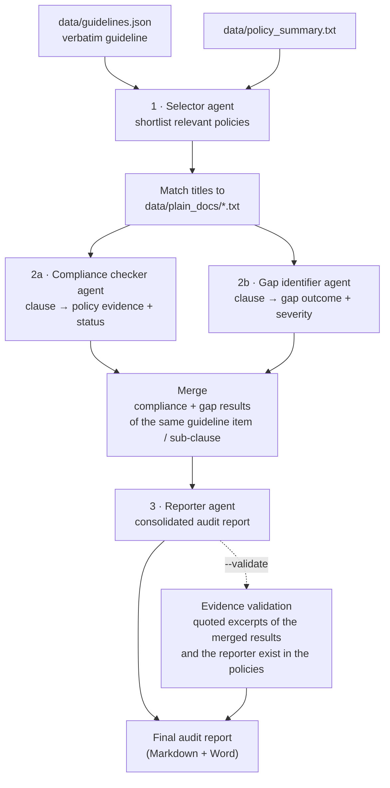

# Compliance-Audit-Agent

A pilot company policy compliance auditing assistant. Given a regulatory guideline, it shortlists the most relevant internal policies. It then runs two independent Claude assessments against them: a clause-by-clause compliance check and a design-gap analysis. A reporter agent merges and reconciles the two into one consolidated audit report. Optionally, the tool verifies every cited policy excerpt against the source documents. The final output is an audit report (Markdown, plus a direct Word copy): the reporter's report, with the evidence validation results added after it.

**This is an STP (straight-through processing) tool, not yet an interactive/agentic assistant.** It runs the same fixed steps every time and uses AI models to help work through large volumes of policy documents and analysis. Auditors review the results at the end.

This is the working-code home for the Hackathon 4 plan [`plan-compliance-audit-agent.md`](https://github.com/SAAF-Project/SAAF-Project/pull/117) (pending review in the shared SAAF-Project repository — update this link to the `main` blob once that PR merges). Per the SAAF "Building an agent" guidance, agent source code lives in its own repo while the plan and shared utilities stay in the main repo.

## Focus: verbatim evidence

Audit findings are only useful if the evidence behind them is real, so the agent puts a strong emphasis on verbatim checks. It looks at two questions:

1. **Is the evidence correctly taken from the company's policy files?** Every guideline clause and policy excerpt must be quoted ad verbatim, never paraphrased. Long sentences may only be shortened with `...`, and tables are cited by their caption only. With `--validate`, every quoted excerpt in the merged compliance + gap results and in the reporter's report is checked against the policy files after removing line breaks. Each quote is marked as found or not found, so paraphrased or invented evidence is flagged.
2. **Did the agents work from the correct sources?** The compliance checker and gap identifier only receive the policies shortlisted by the selector. The selector may only pick from the provided policy summary and must never invent or paraphrase policy titles. The reporter may only use the merged results and must never add new references or excerpts. Which document each policy label (`Policy A`, `Policy B`, …) refers to is saved with the policy selector results. Validation then names the actual documents: each result shows the cited reference next to the document(s) where the quote was actually found (`found_in`), so a quote attributed to the wrong policy, or found in none of them, can be spotted.

## Repository layout

```
prompts/                   Full agent prompts (system + user prompt) — single source of truth
  selector-agent.md
  compliance-checker-agent.md
  gap-identifier-agent.md
  reporter-agent.md
scripts/                   Pipeline code
  orchestration.py         Entry point — runs the full workflow per guideline
  build_prompt.py          Loads prompts/*.md, fills placeholders, builds knowledge chunks
  claude_config.py         Anthropic client + run configuration (env vars)
  json_utils.py            Parses the agents' replies (JSON, and the reporter's Markdown report)
  md_to_docx.py            Simple, direct Markdown → Word copy of the final audit report
  validate_func.py         Verbatim evidence validation (quoted excerpts vs. original policy documents)
```

Local-only folders (git-ignored, never committed):

```
data/                      Input data (guidelines, policy summary, policy documents); only the empty data/plain_docs/ folder is committed (via .gitkeep)
prog_res/                  Per-run workflow outputs (default --progress-path)
```

## Workflow

`scripts/orchestration.py` runs the workflow below once for every guideline number in `GUIDELINES_TO_CHECK`. Every stage writes its prompt, its raw model output and its parsed output to the progress folder (`--progress-path`, default `prog_res/`), so each step can be inspected.



1. **Selector** — reads the guideline and a short summary of the company's policies, and picks the policies most relevant to that guideline.

2. **Policy loading** — loads the selected policy documents so both assessment agents work from the same source material, and records which document is which.

3. **Compliance checker** — breaks the guideline into individual requirements and, for each one, finds the supporting policy text and rates how well the requirement is met.

4. **Gap identifier** — independently reviews the same requirements and policies to find where the policies fall short and how serious each gap is.

5. **Merge** — combines the compliance check result and the gap check result of the same guideline item or sub-clause.

6. **Reporter** — reviews the combined findings, resolves disagreements between the two assessments conservatively, and writes one consolidated audit report without adding new evidence.

7. **Evidence validation** (optional) — runs after the reporter and checks that the policy text quoted as evidence, both in the merged results and in the reporter's report, really appears in the company's policy documents.

8. **Audit report** — saves the reporter's report as a Markdown file, with the validation results added after it, plus a direct Word copy of the same file. This is the final output.

**No credentials are hard-coded**: the API key is read from `ANTHROPIC_API_KEY`.

## Requirements

```bash
python -m venv .venv
source .venv/bin/activate        # Windows: .venv\Scripts\activate
pip install -r requirements.txt
```

- Python 3.10+
- An Anthropic API key in your environment:
  ```bash
  export ANTHROPIC_API_KEY=sk-ant-...
  ```

## Input data

Put these files in `data/` (git-ignored). Never commit real audit evidence or personal data (SAAF rule); use synthetic or anonymized data only. Each input can be moved elsewhere with `--guideline-file`, `--policy-summary-file` and `--policy-path`:

| Path | Contents |
|---|---|
| `data/guidelines.json` | Existing regulatory guideline as a dictionary per guideline item, used to load each item's verbatim text (items chosen in `GUIDELINES_TO_CHECK`) |
| `data/policy_summary.txt` | One-line-per-policy summary used by the selector |
| `data/plain_docs/*.txt` | Full plain-text policy documents (filenames should match policy titles) |

## Running

Run from the repository root. Outputs are written to the progress folder (`./prog_res` by default), which is created if it does not exist:

```bash
python scripts/orchestration.py              # full run
python scripts/orchestration.py --validate   # full run + evidence validation
python scripts/orchestration.py --policy-path ./my_policies --guideline-file ./my_guidelines.json --progress-path ./runs
```

Pick guidelines by editing `GUIDELINES_TO_CHECK` at the top of `orchestration.py`.

| Flag | Effect |
|---|---|
| `--validate` | Run evidence validation and add the results after the reporter's report in the final audit report |
| `--no-data-testmode` | With `--validate` and `--load-progress`, also load that run's saved validation reports instead of re-running validation |
| `--load-progress TS` | Offline run: no API calls are made. Every agent reply is loaded from the saved outputs of run `TS` in the progress folder, and the combined results JSON is marked as offline (no default) |
| `--policy-path DIR` | Folder of plain-text policy documents (default `./data/plain_docs`) |
| `--guideline-file FILE` | Guidelines JSON file (default `./data/guidelines.json`) |
| `--policy-summary-file FILE` | One-line-per-policy summary used by the selector (default `./data/policy_summary.txt`) |
| `--progress-path DIR` | Progress folder where all run outputs are written and saved validation reports are loaded from (default `./prog_res`) |
| `--save-raw-results` | Also save the raw results JSON with every agent's output (`<progress-path>/output_<n>_<ts>.json`); not saved by default |
| `--findings-file FILE` | Save the raw results JSON to this path instead (implies `--save-raw-results`). A fixed path is overwritten by each guideline when several are checked |

## Configuration

`scripts/claude_config.py` reads everything from environment variables (defaults shown):

| Variable | Default | Purpose |
|---|---|---|
| `ANTHROPIC_API_KEY` | _(required)_ | API key, read by the SDK automatically |
| `ANTHROPIC_MODEL` | `claude-sonnet-4-6` | Model id |
| `MODEL_TEMPERATURE` | `0.0` | Sampling temperature. Works with the default `claude-sonnet-4-6`; newer models such as Claude Opus 4.7+ reject sampling parameters |
| `MAX_WORKERS` | `6` | Parallel request workers |
| `MAX_RETRIES` | `4` | Retries per model call, done by the Anthropic SDK with exponential backoff (connection errors, 408, 409, 429, 5xx) |
| `REQUEST_TIMEOUT_SECONDS` | `600` | Request timeout (the SDK default) |
| `FILE_LIMIT` | `0` | Max policy files to load (`0` = no limit) |
| `MAX_PROMPT_TOKENS` | `40000` | Prompt token budget |
| `RESPONSE_MAX_TOKENS` | `16384` | Max response tokens |

## Known gaps / TODO

- Add user checkpoints: there are several points in the process where auditors could pause the run to review, give feedback or make adjustments, so that only the affected part of the analysis is redone. Today the tool runs straight through without stopping.
- Currently, validation only checks whether the quoted excerpts are verbatim from the original policy documents. Location validation (policy title, section and line range in "Policy Reference") is planned for later work.
- Sample/synthetic input data is not included yet.

## Ownership / data handling

Built by Junhan Wen and polished/processed with Claude. This is a pilot project developed to assist real-life audit work; this repository is the SAAF-hackathon version. Do not commit real audit evidence, personal data, or credentials; use synthetic or anonymized data only.
